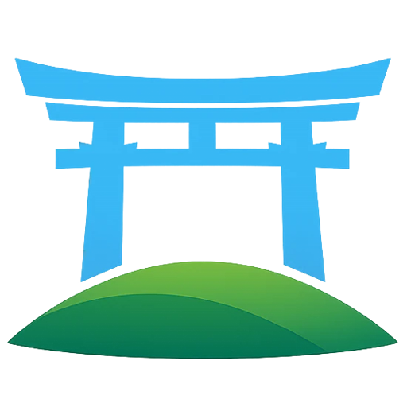

  

<h1 align="center">Torii SRS — Issues &amp; Feature Requests</h1>

  The public tracker for the <b>Torii SRS</b> web app: a free Japanese vocabulary trainer 
  built on spaced repetition. Report a bug, or ask for something that isn't there yet.

  
  
  
  

  <a href="https://app.torii-srs.com">Open the app</a> ·
  <a href="https://app.torii-srs.com/faq">Knowledge Base</a> ·
  <a href="https://github.com/Rakantor/torii-srs-public/issues">Browse issues</a>

---

## What this repository is

An issue list, and nothing else. There is no source code here.

It exists so that bugs and feature requests are **public** — you can see what's already been
reported, add to it, and watch it get fixed. Everything else has a better address:

| I want to… | Go here |
| :--- | :--- |
| Report something broken | [Bug report →](https://github.com/Rakantor/torii-srs-public/issues/new?template=bug_report.yml) |
| Suggest a feature or a change | [Feature request →](https://github.com/Rakantor/torii-srs-public/issues/new?template=feature_request.yml) |
| Ask how something works | [Knowledge Base →](https://app.torii-srs.com/faq)  |
| Get help with an account, a payment or your data | Use the contact form in the app or on the website |
| Anything else | Use the contact form in the app or on the website |

## Before you open an issue

Three things fix most of what gets reported, and they take a minute:

- [ ] **Search the [existing issues](https://github.com/Rakantor/torii-srs-public/issues?q=is%3Aissue).**
      Include closed ones — it may already be fixed and waiting on a release. Found it? Add a
      👍 and a comment rather than a new issue; both help more than a duplicate.
- [ ] **Check the cloud icon** at the foot of the navigation menu. Items queued there mean you
      are offline or the server is out of reach, and the app is behaving correctly.
- [ ] **Clear local storage** in *Settings → Account*. It throws away the local copy and
      downloads your data again. Your progress is on the server and your preferences survive.

Two things that look like bugs but aren't:

- **Private / incognito windows.** Torii keeps your whole collection in the browser's local
  database, which is what lets it work offline. Private windows restrict or wipe that storage,
  so it cannot start properly. A normal window is the fix.
- **Old browsers.** Current versions of Chrome, Firefox, Safari and Edge are supported, on
  desktop and mobile — plus anything built on them, like Brave, Vivaldi or Arc. Cookies need
  to be on; that's how you stay signed in.

## What makes a report easy to fix

The [bug report form](https://github.com/Rakantor/torii-srs-public/issues/new?template=bug_report.yml)
asks for all of this, so you can just fill it in:

- **What you did, step by step** — enough that we can do the same thing and watch it break.
- **What you expected, and what happened instead.** Both, even when one seems obvious.
- **Where in the app** — Lessons, Reviews, the dashboard, Settings.
- **Browser, version and device.** "Safari 18 on an iPhone" is plenty.
- **A screenshot**, if there's anything to see. Drag it straight into the form.

> [!TIP]
> **The diagnostics file belongs in the contact form, not here.** If you have an account, the
> in-app contact form (*Knowledge Base → Still stuck?*) can attach a record of what the app did
> on your device over the last couple of weeks — which saves you describing any of it. It holds
> no email address and nothing you wrote, but this tracker is public, so send it there and
> mention the issue number here.

## In scope, and out

**In scope:** anything in the web app at [app.torii-srs.com](https://app.torii-srs.com) — the
site itself, the installed app, offline behaviour, syncing, reviews, lessons, stats, settings.
Wrong or missing word data counts too: readings, meanings, pitch accents, audio, example
sentences.

**Out of scope:**

- **The old Desktop and Android (Java) apps.** They're a separate, unmaintained thing; issues
  about them may be closed without a reply.
- **Account, billing and privacy requests.** They need your email address, which shouldn't be
  in a public issue — use the contact form in the app or on the website instead.
- **Support questions.** Try the [Knowledge Base](https://app.torii-srs.com/faq) first; if it
  doesn't answer you, write to us and we'll answer directly.

## What happens next

Every issue gets read. Not every one gets built — the honest version is that Torii is small,
there are no ads and no investors, and time goes where it helps the most people.

What you can expect: a reply, a label (`bug`, `enhancement`, `needs-info`, `duplicate`), and a
close when the fix ships. Shipped changes should show up in the app's release notes and under
*Knowledge Base → What's new*. Feature requests that aren't planned get told so plainly rather
than left open forever.

## Thank you!

Every bug someone bothered to write up made this app better than it would have been. It is
appreciated more than the issue-closing note lets on.

  一つずつ — one at a time.

